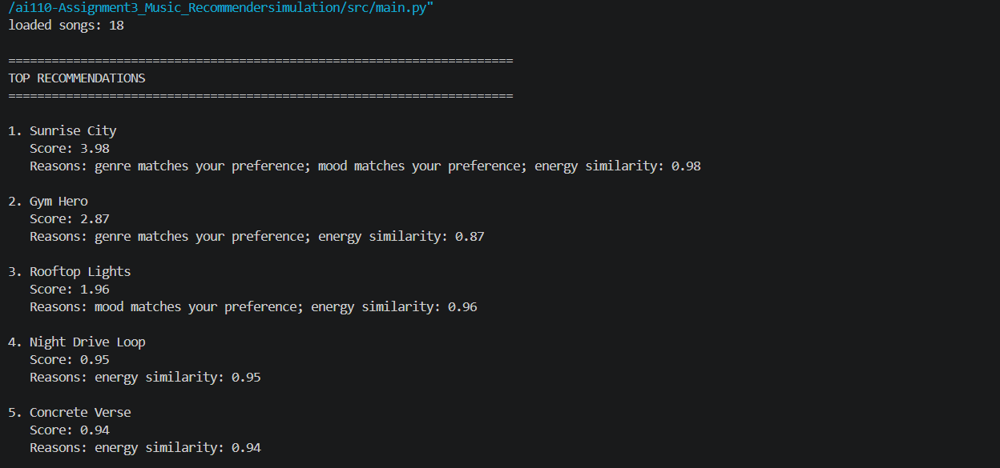

# 🎵 Music Recommender Simulation

## Project Summary
>This project demonstrates a small music recommender system. It represents songs and a user "taste profile" as data, designs a scoring rule that turns that data into recommendations and evaluates what the system gets right and wrong.

---

## How The System Works

_What features does each `Song` use in your system_
  - genre: 0.30
  - mood: 0.20
  - energy: 0.15
  - tempo_bpm: 0.10
  - danceability: 0.10
  - valence: 0.10
  - acousticness: 0.05
  - artist (optional): not considered

_What information does your `UserProfile` store_
  - User can list down their favorite genre and mood. The model will use this information to recommend songs.

_How does your `Recommender` compute a score for each song_
- It uses the following formula:
  - Energy_pts   = 3.5 * (1.0 - abs(song["energy"]  - user_prefs.get("energy", 0.5)))
  - valence_pts = 2.5 * (1.0 - abs(song["valence"] - user_prefs.get("valence", 0.5)))
  - danceability_pts = 3.0 * (1.0 - abs(song["danceability"] - user_prefs.get("danceability", 0.5)))
  - acousticness_pts = 2.0 * (1.0 - abs(song["acousticness"] - user_prefs.get("acousticness", 0.5)))
  - tempo_norm = (song["tempo_bpm"] - tempo_min) / (tempo_max - tempo_min) ; tempo normalization to 0 to 1
  - tempo_pts = 2.5 * (1.0 - abs(tempo_norm - user_prefs.get("tempo_norm", 0.5)))

  - Total score = valence_pts + danceability_pts + acousticness_pts + tempo_pts  

_How do you choose which songs to recommend_
  - We will recommend songs based on the weighting system provided above. If the total score for any song is greater than 0.9, then it will be recommended to the user.


## Phase 2, Step 5: Finalized Algorithm Recipe
flowchart TD
  - A[Input: User Preferences<br/>favorite genre, favorite mood, target energy]
  - B[Load songs from songs.csv]
  - C[For each song in dataset]
  - D{Genre matches user?}
  - E[+2.0 points]
  - F{Mood matches user?}
  - G[+1.0 point]
  - H[Compute energy similarity<br/>1 - abs(song.energy - target_energy)]
  - I[Add energy similarity points]
  - J[Save song + total score]
  - K[Sort all songs by score descending]
  - L[Select Top K songs]
  - M[Output recommendations with explanations]

    A --> B --> C
    C --> D
    D -- Yes --> E --> F
    D -- No --> F
    F -- Yes --> G --> H
    F -- No --> H
    H --> I --> J --> C
    C --> K --> L --> M

## Phase3: Step 4
 - Terminal output showing the recommendations (song titles, scores, and reasons) for given user profile (pop)

---

## Getting Started

### Setup

1. Create a virtual environment (optional but recommended):

   ```bash
   python -m venv .venv
   source .venv/bin/activate      # Mac or Linux
   .venv\Scripts\activate         # Windows

2. Install dependencies

```bash
pip install -r requirements.txt
```

3. Run the app:

```bash
python -m src.main
```

### Running Tests

Run the starter tests with:

```bash
pytest
```

You can add more tests in `tests/test_recommender.py`.

---

## Experiments You Tried

- Added songs with more variety to the songs.csv list
- Added edge-case user profiles to main.py and tested the recommender 
- Implemented the following change to test the system's sensitivity: Weight Shift: Double the importance of energy and half the importance of genre
---

## Limitations and Risks
- Some of the limitations are that it only works on a tiny catalog and does not understand lyrics or language.

---

## Reflection

[**Model Card**](model_card.md)

Recommenders can turn data into predictions by analyzing songs based on their features and by implementing a scoring system. By assigning numeric values to different features of a song, we can have the recommender prioritize the features it should use to select top songs. In this project, numeric scores make it possible to rank songs in a transparent way, because we can see how genre, mood, and energy each contribute to the final recommendation score. Assigning weights helps the model prioritize what matters most, but it also means the ranking is shaped by design choices, not just user intent.

Bias and unfairness can appear when the dataset is small or lacks variety in genres, moods, and song styles. If certain listener types are underrepresented, the recommender may repeatedly push users toward the same narrow set of songs and fail to reflect diverse tastes. This can make the system seem accurate for common profiles while performing worse for users with mixed, niche, or conflicting preferences. 

---
## Model Card Document

The finalized model card content has been moved to [model_card.md](model_card.md) to avoid duplicates.
