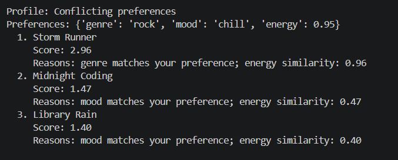
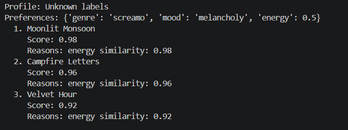
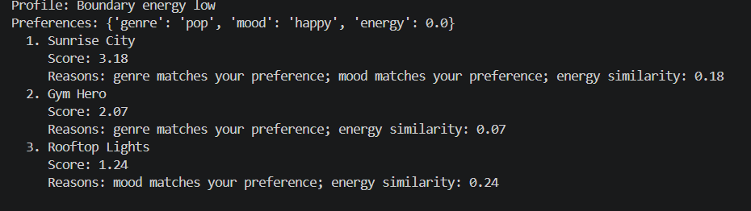
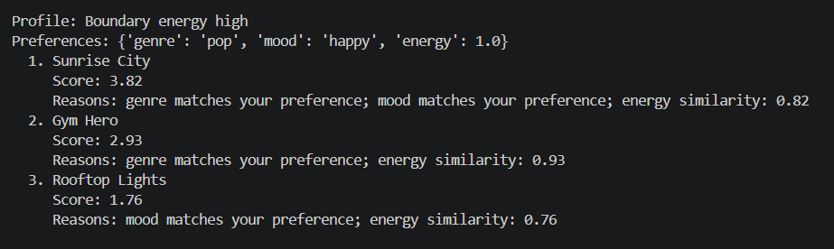
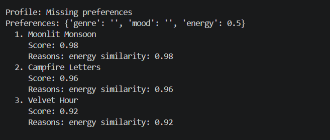
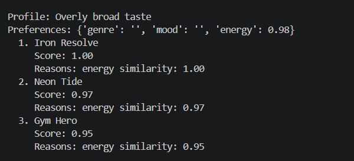
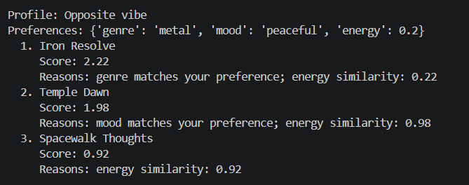

# 🎧 Model Card - Music Recommender Simulation

## 1. Model Name:
Taste Music

---

## 2. Intended Use
This model suggests 3 to 5 songs from a small catalog based on a user's preferred genre, mood, and energy level. It is for classroom exploration only, not for real users.

---

## 3. How It Works (Short Explanation)

Songs are recommended to the user based on preferred genre, mood, and energy level. For each song, the system gives points when the genre matches and when the mood matches. It also gives similarity points based on how close the song's energy is to the user's target energy. These points are added together into one final score, then all songs are sorted from highest to lowest score. The top songs are returned as recommendations.

---

## 4. Data

The dataset contains 18 songs in `data/songs.csv`. I added 8 more songs to add more variety. I also used the provided catalog to test both normal and edge-case user profiles. The songs cover multiple genres (such as pop, lofi, rock, metal, jazz, classical, hip-hop, edm, and others) and moods (such as happy, chill, intense, peaceful, confident, moody, and romantic). Because the catalog is small and curated, it reflects a limited and synthetic set of tastes rather than the full diversity of real listeners.

---

## 5. Strengths

A major strength is simplicity and transparency. It is easy to explain why a song was recommended, because each recommendation is based on clear factors (genre match, mood match, and energy similarity). The system works best for users with clear preferences that exist in the catalog, such as high-energy pop/happy profiles or low-energy lofi/chill profiles. In these cases, the top-ranked songs usually align well, and the explanation provided in the output also makes the ranking behavior seem reasonable.

---

## 6. Limitations and Bias

One limitation was Low-energy user marginalization: Only 1 song with "peaceful" (classical, 0.22 energy), compared to multiple high-energy options. Calm listeners have far fewer options and can get pushed into a narrow recommendation bucket.

---

## 7. Evaluation

I verified the functionality of the system by trying multiple user profiles and noting whether the results matched your expectations. The following user profiles were tested.

Adversarial or edge-case profiles to try:

- Conflicting preferences: `{"genre": "rock", "mood": "chill", "energy": 0.95}`. This checks whether the scorer over-trusts one field when the rest disagree.

  

- Unknown labels: `{"genre": "screamo", "mood": "melancholy", "energy": 0.5}`. This checks whether the system gracefully handles values that do not exist in the catalog.

  

- Boundary energy: `{"genre": "pop", "mood": "happy", "energy": 0.0}` and `{"genre": "pop", "mood": "happy", "energy": 1.0}`. This checks whether the scoring logic behaves sensibly at the extremes.

  
  

- Missing preferences: `{"genre": "", "mood": "", "energy": 0.5}`. This checks whether the recommender falls back to energy alone instead of crashing or producing unstable results.

  

- Overly broad taste: `{"genre": "", "mood": "", "energy": 0.98}`. This checks whether the recommender becomes dominated by a single numeric feature.

  

- Opposite vibe: `{"genre": "metal", "mood": "peaceful", "energy": 0.2}`. This checks whether the score can be tricked by a strong genre match even when the mood and energy disagree. (Yes)

  

---

## 8. Future Work

If I had more time, I would improve this recommender by adding in support for multiple users. Some music lovers like to listen to music in groups or with their friends, so it would be nice to have a option for "group vibe" recommendations.

---

## 9. Personal Reflection

The system was able to moderately correct in recommending songs to the user based on their user profile. However, real music recommenders consider a lot of other additional features while choosing the list of top songs. One surprising result was that when users gave unusual or conflicting preferences, the system still returned songs by relying heavily on energy similarity, even if genre and mood did not match perfectly. Building this project helped me understand that recommendation quality depends not only on the algorithm, but also on the diversity and balance of the dataset. Human judgment still matters when deciding whether recommendations are meaningful, fair, and context-appropriate, especially when users have complex tastes that a simple scoring formula cannot fully represent.
